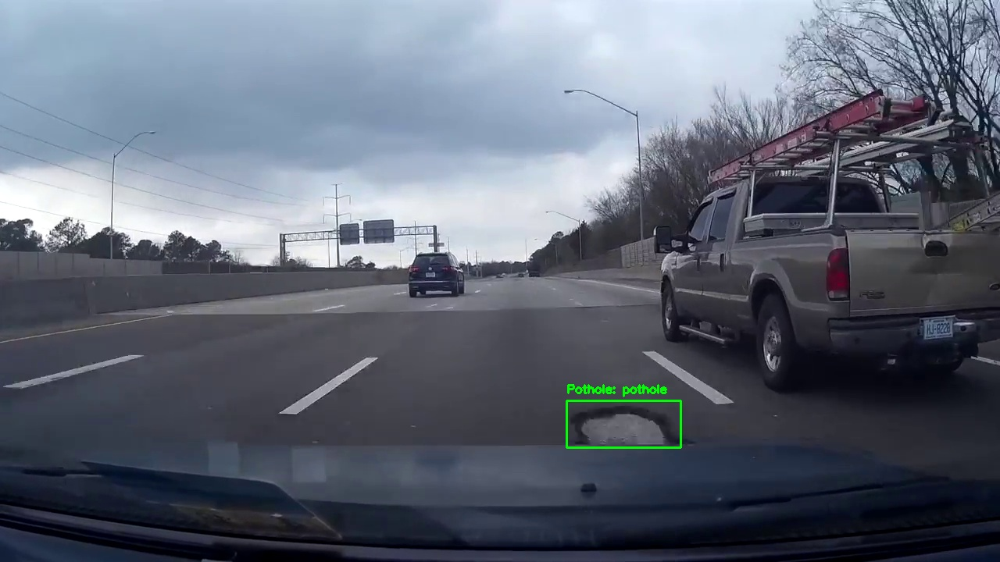

# Pothole Detection with YOLOv8

This project is a work in progress with the goal of detecting potholes using cameras mounted in cars/trucks using YOLOv8. This project utilises a YOLOv8 model trained extensively on a dataset containing a variety of images of potholes. The idea of the project is to assist in documenting potholes in local government areas. As it is a work in progress, the ability to log locations and other features has not yet been added. 

## Getting Started

To use this project for detecting potholes, follow the steps below:

1. Clone this repository.
2. Install the required dependencies.
3. Use the provided pre-trained weights or train the model with your dataset.

## Prerequisites

Ensure you have the following installed:

- Python 3.8 or above
- PyTorch 1.8 or above
- Other dependencies listed in `requirements.txt`

## Installation

To set up your environment to run the code, follow these steps:

```
git clone https://github.com/rgreenhillbrown/pothole-detection.git
cd pothole-detection
pip install -r requirements.txt
```

## Usage

To detect potholes in images:

```
python detect.py --weights last.pt --img 640 --conf 0.4 --source data/images
```

For real-time pothole detection:

```
python detect.py --weights last.pt --img 640 --conf 0.4 --source 0  # for webcam
```

For a YouTube video/stream:

```
python detect.py --weights last.pt --img 640 --conf 0.4 --source "https://youtube.com/your-url-here"
```

## Training

To train the model with your dataset:

```
python train.py --img 640 --batch 16 --epochs 50 --data dataset.yaml --weights yolov8.pt
```

Ensure you have your `dataset.yaml` file configured correctly for training.

The dataset used for training is not included here, but using your own data you can train it yourself. 
The .yaml file you use to instruct the model should use the following outline:

```
path: ../
train: train/images
val: valid/images
test: test/images

nc: 1
names: ["pothole"]
```

## Configuration

Modify the `hyp.yaml` to tweak hyperparameters for training.

## Example Detection

Here is an example of the pothole detection in action:



## License

This project is licensed under the MIT License - see the `LICENSE.md` file for details.

## Acknowledgments

- The YOLOv8 team for providing an efficient and powerful object detection algorithm.

